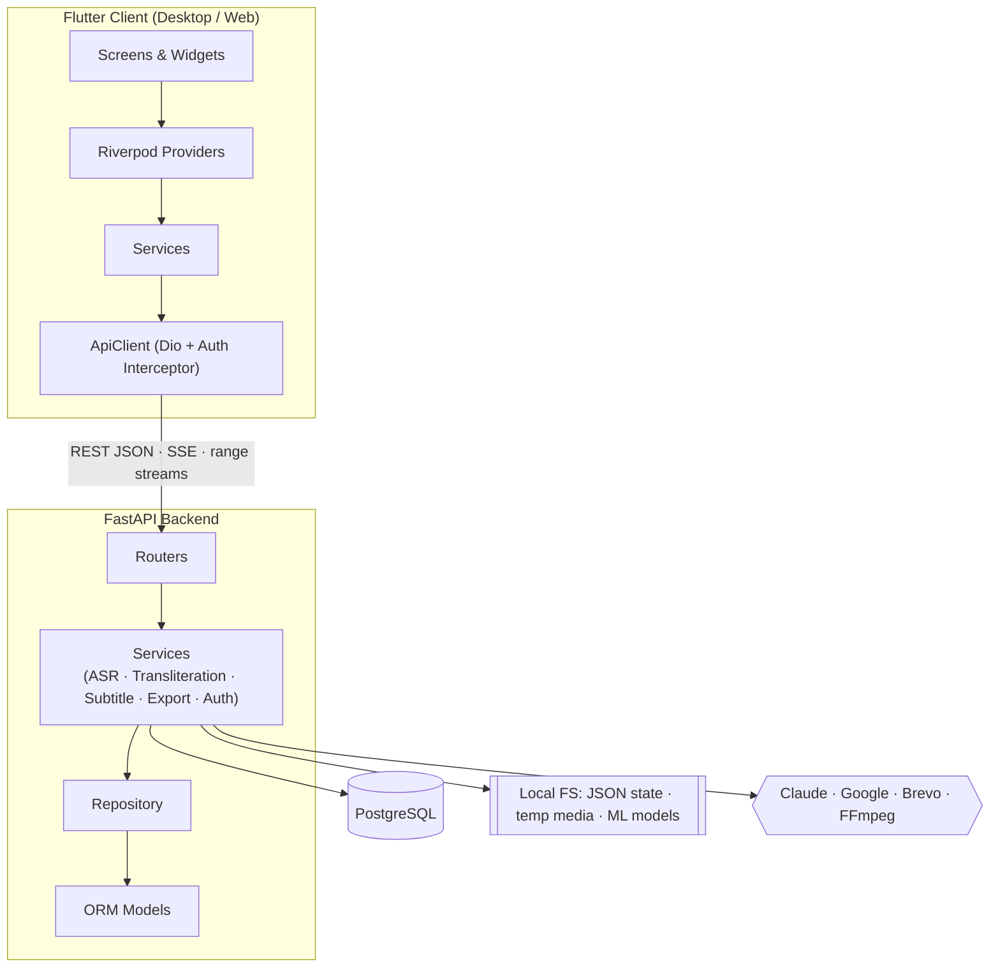
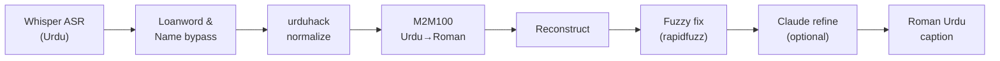
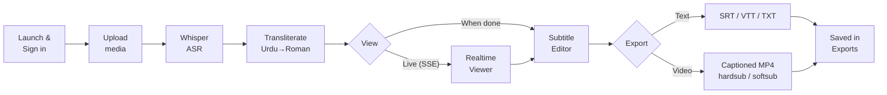

# RomaSub.AI — Project Brief

**Roman Urdu Caption Generator** · COMSATS University Islamabad, Abbottabad Campus · BS Software Engineering FYP (2022–2026)
Muttayyab Abdurrehman · Muhammad Hashir · Muneeb Khan — Supervisor: Dr. Osman Khalid

---

## What it is

RomaSub.AI automatically generates **Roman Urdu subtitles** from Urdu speech in video/audio. A user uploads media; the system transcribes the Urdu with Whisper ASR, transliterates it to readable Roman Urdu through a fine-tuned M2M100 pipeline, and presents time-aligned captions in a full subtitle editor with export to SRT/VTT/TXT or a captioned MP4. It is a **Flutter desktop/web client** talking to a **FastAPI (Python) backend**.

---

## Key Features

- **Urdu → Roman Urdu captioning** with accurate timestamps.
- **Loanword & name preservation** — English words and Pakistani names (~1,041 loanwords, ~189 names) are kept intact instead of being phonetically mangled.
- **Optional AI polish** — Claude Haiku 4.5 refines the output (fully fail-safe; falls back to raw model output on any error).
- **Two modes** — *batch* (upload, wait, edit) and *real-time* (watch captions stream in live over SSE while the file processes, with seek reprioritization).
- **Full subtitle editor** — edit text & timing, add/delete segments, search, auto-fix overlaps, undo/redo (50 levels), 30-second auto-save, keyboard shortcuts.
- **Export** — SRT, WebVTT, plain text, and captioned MP4 (hardsub burned-in or softsub toggleable track).
- **Accounts** — register, email OTP verification, login, Google OAuth (web + desktop), password reset, profile & avatar.
- **Cross-platform** — single Flutter codebase for Windows/Linux/macOS/web; light & dark themes.

---

## Main Modules

| # | Module | Responsibility |
|---|---|---|
| 1 | **Authentication & User** | Register, OTP email verification, login, Google OAuth (id-token + desktop code), password reset/change, profile & avatar. JWT-secured. |
| 2 | **Media Input Handler** | Upload + validate video/audio, extract 16 kHz mono audio (FFmpeg), range-enabled streaming for the player. |
| 3 | **ASR (Speech Recognition)** | Transcribe Urdu audio to timed segments with OpenAI Whisper; auto-triggers transliteration. |
| 4 | **Transliteration Engine** | The core pipeline: loanword/name bypass → urduhack normalization → fine-tuned M2M100 → reconstruction → fuzzy correction → optional Claude refine. |
| 5 | **Real-time Streaming** | Chunk-by-chunk caption delivery over SSE, buffer-then-play, seek reprioritization, instant replay of cached files. |
| 6 | **Subtitle Editing & Projects** | Persistent subtitle projects, per-segment edit/timing/validation, overlap fixing, project listing. |
| 7 | **Export** | SRT/VTT/TXT and captioned-video (hardsub/softsub) rendering via FFmpeg, plus export history. |
| 8 | **Feedback** | Star rating + comment, stored in PostgreSQL. |

---

## Architecture

Two-tier **client–server**, **layered** on both sides.

**Backend (FastAPI):** four layers — `Routers` (HTTP/SSE endpoints) → `Services` (business logic & ML orchestration, mostly stateless functions) → `Repository` (data access) → `Models` (SQLAlchemy). Cross-cutting `Config`, `Schemas` (Pydantic), `Security`.

**Frontend (Flutter):** four layers — `Screens/Widgets` → `Providers` (Riverpod state notifiers) → `Services` (API wrappers) → `ApiClient` (Dio with JWT-injecting interceptor). Cross-cutting `Models`, `Core` (routes, theme, constants).

**Persistence:** PostgreSQL holds users, OTPs, media metadata, and feedback; subtitle projects + export history persist to an atomic JSON state file; transcription results, the media registry, and live streaming sessions are in-memory per process.

### The Transliteration Pipeline (the core)

---

## End-to-End Flow

How a user moves through the system, and what happens behind each step.

**Step by step:**

1. **Launch & sign in** — splash screen → login, sign-up (with email OTP verification), or Google OAuth.
2. **Upload** — pick a video/audio file from the dashboard; the backend validates it and extracts 16 kHz mono audio if it is a video.
3. **Transcribe** — Whisper converts Urdu speech to time-stamped segments; transliteration runs automatically.
4. **Transliterate** — each segment passes through the pipeline (loanword bypass → normalize → M2M100 → reconstruct → fuzzy fix → optional Claude refine).
5. **View** — either watch captions stream in **live** (real-time viewer, SSE) or open the finished project in the **editor**.
6. **Edit** — correct Roman text, nudge timings, add/delete segments, auto-fix overlaps; changes auto-save every 30 s with undo/redo.
7. **Export** — download SRT/VTT/TXT or render a captioned MP4 (burned-in or toggleable track). Exports are listed in the Exports screen.

---

## Technology Stack

| Area | Tech |
|---|---|
| **Client** | Flutter / Dart, Riverpod, Dio, media_kit, google_sign_in, flutter_secure_storage |
| **Backend** | FastAPI, Pydantic v2, Uvicorn |
| **Database** | PostgreSQL, SQLAlchemy |
| **ASR** | OpenAI Whisper (`medium`), PyTorch |
| **Transliteration** | Fine-tuned M2M100 (Hugging Face Transformers), urduhack, rapidfuzz |
| **AI refine** | Anthropic Claude (Haiku 4.5) |
| **Media** | FFmpeg (audio extraction + captioned-video render) |
| **Auth/Email** | JWT (python-jose), bcrypt, Google OAuth, Brevo |

---

*For full detail (requirements, all endpoints, data model, sequence/state diagrams, design rationale) see `PROJECT_SUMMARY.md` / `PROJECT_SUMMARY.pdf`.*
