# RomaSub.AI — Comprehensive Project Summary

**Roman Urdu Caption Generator**

A reference document covering the project from high-level abstract down to individual services. It is written to be the single source for thesis chapters, project reports, and UML/sequence/ER/state/use-case diagrams.

---

## Document Control

| Field | Value |
|---|---|
| Project title | RomaSub.AI — Roman Urdu Caption Generator |
| Document type | Master project summary / technical reference |
| Version | 1.0.0 |
| Status | As-built (reflects current source code on branch `AddDownloadFeature`) |
| Authors | Muttayyab Abdurrehman (CIIT/FA22-BSE-046/ATD), Muhammad Hashir (CIIT/FA22-BSE-031/ATD), Muneeb Khan (CIIT/FA22-BSE-032/ATD) |
| Supervisor | Dr. Osman Khalid |
| Institution | COMSATS University Islamabad, Abbottabad Campus |
| Programme | Final Year Project — BS Software Engineering (2022–2026) |
| License | MIT |

> **How to use this document.** Sections 1–6 give the high-level abstract, requirements, actors, and architecture (use-case, component, package, deployment diagrams). Section 7 details the core transliteration pipeline (activity/data-flow diagrams). Sections 8–9 give per-service backend and frontend design (class diagrams). Section 10 is the data model (ER + class diagrams). Section 11 is the full API surface. Section 12 contains step-by-step sequence flows (sequence diagrams) with ready-to-render Mermaid. Sections 13–14 cover state transitions and data flow. Sections 15–19 cover rationale, security, limitations, future work, and appendices.

---

## Table of Contents

1. [Introduction](#1-introduction)
2. [System Overview](#2-system-overview)
3. [Requirements](#3-requirements)
4. [Use Cases](#4-use-cases-use-case-diagram-source)
5. [System Architecture](#5-system-architecture)
6. [Technology Stack](#6-technology-stack)
7. [The Transliteration Pipeline (Core Innovation)](#7-the-transliteration-pipeline-core-innovation)
8. [Backend Detailed Design](#8-backend-detailed-design)
9. [Frontend Detailed Design](#9-frontend-detailed-design)
10. [Data Model](#10-data-model-er--class-diagram-source)
11. [Complete API Reference](#11-complete-api-reference)
12. [Sequence Flows](#12-sequence-flows-sequence-diagram-source)
13. [State Transition Models](#13-state-transition-models-state-diagram-source)
14. [Data Flow](#14-data-flow-dfd-aligned)
15. [Design Decisions and Rationale](#15-design-decisions-and-rationale)
16. [Security Considerations](#16-security-considerations)
17. [Limitations and Known Gaps](#17-limitations-and-known-gaps)
18. [Future Work](#18-future-work)
19. [Appendices](#19-appendices)

---

## 1. Introduction

### 1.1 Abstract

RomaSub.AI is an AI-assisted desktop application that automatically generates **Roman Urdu subtitles** from Urdu speech in video and audio files. A large share of Pakistani audiences read Urdu more comfortably in the Latin (Roman) script than in the native Nastaʿlīq script, yet almost every automatic captioning tool either produces native Urdu script or English translation. RomaSub.AI fills that gap: a user uploads media, the system transcribes the Urdu speech with OpenAI Whisper, transliterates each segment into Roman Urdu through a multi-layer pipeline built around a fine-tuned M2M100 neural model, and presents time-aligned captions in a full subtitle editor. The user can review and edit captions, watch a live preview while transcription streams in, and export the result as SRT, WebVTT, plain text, or a captioned MP4 (burned-in or toggleable subtitle track).

The system is a two-tier client–server application: a **FastAPI (Python)** backend that hosts the ML pipeline and REST/SSE API, and a **Flutter** cross-platform desktop/web client that provides authentication, upload, real-time preview, subtitle editing, and export.

### 1.2 Problem Statement

Existing automatic speech-to-text and captioning systems do not serve Roman Urdu well:

- General ASR engines output **native Urdu script**, which a large segment of the target audience finds slower to read than Roman Urdu.
- Generic transliteration tools mangle **English loanwords** and **Pakistani proper nouns** that are extremely common in spoken Urdu (e.g. "laptop", "hospital", names like "Muhammad", "Imran").
- Manual Roman Urdu subtitling is slow and inconsistent in spelling conventions.

RomaSub.AI addresses these by combining ASR, dictionary-guided loanword handling, a fine-tuned transliteration model, fuzzy correction, and an optional LLM polishing stage, wrapped in an editor that keeps a human in the loop.

### 1.3 Objectives

1. Transcribe Urdu speech from video/audio accurately with timestamps.
2. Convert native Urdu transcription into readable, convention-consistent Roman Urdu.
3. Preserve English loanwords and proper nouns rather than transliterating them phonetically.
4. Provide a real-time, incremental preview so users can start watching before the whole file finishes processing.
5. Offer a complete subtitle editor (edit text, adjust timing, fix overlaps, undo/redo, auto-save).
6. Export captions in standard formats (SRT, VTT, TXT) and as a captioned video (MP4 hardsub/softsub).
7. Provide secure user accounts (email/password, Google OAuth, email verification, password reset).
8. Run cross-platform (Windows, Linux, macOS desktop; web) from a single Flutter codebase.

### 1.4 Scope

**In scope (implemented):** account management; media upload and validation; Whisper ASR; the full Roman-Urdu transliteration pipeline; batch and real-time (SSE) processing; subtitle project persistence and editing; SRT/VTT/TXT export; captioned-video export; feedback collection.

**Out of scope (current version):** subtitle styling/positioning controls in video export; background job queue for long renders (rendering is synchronous); multi-user collaboration on the same project; cloud storage of media (media metadata is held in memory and source files are temporary); automatic Urdu diacritization (a reserved, currently no-op stub); mobile-first UI (the app targets desktop/web primarily).

### 1.5 Stakeholders and Target Users

- **Content creators / subtitlers** producing Roman Urdu captions for vlogs, lectures, dramas, and social clips.
- **Viewers** who prefer Roman Urdu reading.
- **Students/educators** captioning Urdu lecture recordings.
- **Project team and supervisor** (development, evaluation, thesis).

### 1.6 Glossary

| Term | Meaning |
|---|---|
| ASR | Automatic Speech Recognition (speech → text). |
| Roman Urdu | Urdu written in the Latin alphabet (e.g. "aap kaise hain"). |
| Transliteration | Script-to-script conversion (Urdu Nastaʿlīq → Roman), not translation. |
| Loanword | A foreign (mostly English) word used in Urdu speech (e.g. "computer"). |
| M2M100 | Facebook's multilingual sequence-to-sequence model, here fine-tuned for Urdu→Roman Urdu. |
| Whisper | OpenAI's open ASR model used for Urdu transcription. |
| SSE | Server-Sent Events — a one-way HTTP streaming protocol used for real-time captions. |
| Hardsub / Softsub | Captions burned into the video pixels / muxed as a toggleable subtitle track. |
| OTP | One-Time Password used for email verification and password reset. |
| Segment | One timed caption unit: start time, end time, Urdu text, Roman Urdu text. |

---

## 2. System Overview

### 2.1 High-Level Description

```
                         ┌──────────────────────────────────────────────┐
                         │            Flutter Client (Desktop/Web)        │
                         │   Auth · Upload · Realtime Viewer · Editor     │
                         │   Riverpod state · Dio HTTP · media_kit player │
                         └───────────────┬──────────────────────────────┘
                                         │  REST (JSON) + SSE + file streams
                                         ▼
                         ┌──────────────────────────────────────────────┐
                         │              FastAPI Backend (Python)          │
                         │  Routers → Services → Repository → Models      │
                         │                                                │
                         │  ASR (Whisper) → Loanword/Names → urduhack     │
                         │  → M2M100 (Urdu→Roman) → Fuzzy → Claude refine │
                         │  Subtitle store · Realtime sessions · FFmpeg   │
                         └───────┬───────────────────┬──────────────┬─────┘
                                 │                   │              │
                                 ▼                   ▼              ▼
                         ┌─────────────┐     ┌──────────────┐  ┌─────────────┐
                         │ PostgreSQL  │     │ Local files  │  │ External    │
                         │ users/otp/  │     │ JSON state · │  │ Anthropic · │
                         │ media/feedback   │ temp media · │  │ Google ·    │
                         └─────────────┘     │ ML models    │  │ Brevo email │
                                             └──────────────┘  └─────────────┘
```

### 2.2 Key Features

- **Automatic Urdu→Roman Urdu captioning** with timestamps.
- **Loanword and proper-noun preservation** via dictionary bypass (~1,041 loanwords, ~189 names).
- **Optional LLM refinement** (Claude Haiku 4.5) for final polish, fully fail-safe.
- **Two processing modes:** batch (upload, wait, edit) and real-time (watch captions stream in as the file is processed, with seek reprioritization).
- **Full subtitle editor:** per-segment text/timing edit, add/delete segments, search, fix-overlaps, undo/redo (50 levels), 30-second auto-save, keyboard shortcuts.
- **Export:** SRT, WebVTT, plain text; captioned MP4 (hardsub burned-in or softsub toggleable track).
- **Accounts:** register, email verification (OTP), login, Google OAuth (web/mobile id-token and desktop auth-code flows), forgot/reset password, change password, profile + avatar.
- **Feedback:** star rating plus comment.
- **Cross-platform** desktop/web from one Flutter codebase; light and dark themes.

### 2.3 Actors (Use-Case Diagram Source)

| Actor | Type | Role |
|---|---|---|
| **Guest** | Primary (human) | Unauthenticated visitor; can register, log in, recover password. |
| **Registered User** | Primary (human) | Uploads media, transcribes, edits subtitles, exports, gives feedback, manages profile. |
| **Whisper ASR Engine** | Secondary (system) | Transcribes Urdu audio to timed text. |
| **M2M100 Transliteration Model** | Secondary (system) | Converts Urdu chunks to Roman Urdu. |
| **Claude API (Anthropic)** | Secondary (external) | Optional Roman Urdu polishing. |
| **Google OAuth** | Secondary (external) | Federated sign-in / identity. |
| **Brevo Email Service** | Secondary (external) | Delivers OTP emails. |
| **FFmpeg** | Secondary (system) | Audio extraction and captioned-video rendering. |
| **PostgreSQL** | Secondary (system) | Persists users, OTPs, media metadata, feedback. |

### 2.4 Operating Environment

- **Client:** Flutter 3.8.1+ app on Windows, Linux, macOS, or web (Chrome). Desktop uses `window_manager` and `media_kit` (software decoding configured for Linux stability).
- **Server:** Python 3 / FastAPI served by Uvicorn (default `0.0.0.0:8000`); FFmpeg available on PATH (bundled via `static_ffmpeg`); GPU optional (CUDA auto-detected, else CPU).
- **Database:** PostgreSQL 15+.
- **Models on disk:** fine-tuned M2M100 at `models/m2m100_ur_to_rur` + tokenizer at `models/m2m100_tokenizer`; Whisper model downloaded on first use (`medium` by default).

---

## 3. Requirements

### 3.1 Functional Requirements (by Module)

**Module 1 — Authentication & User Management**
- FR-1.1 Register with first/last name, email, password (strength-validated).
- FR-1.2 Verify email via 6-digit OTP (15-minute validity); auto-login on success.
- FR-1.3 Login with email/password; block unverified accounts.
- FR-1.4 Google sign-in via id-token (web/mobile) and authorization-code (desktop loopback) flows.
- FR-1.5 Forgot password → OTP → reset (anti-enumeration responses).
- FR-1.6 Change password (authenticated).
- FR-1.7 View/update profile; upload/delete avatar (≤5 MB image).

**Module 2 — Media Input Handler**
- FR-2.1 Upload video/audio; validate extension and size (≤2048 MB).
- FR-2.2 Extract 16 kHz mono WAV from video via FFmpeg for ASR.
- FR-2.3 Stream media with HTTP range support (seeking).
- FR-2.4 Report file metadata; delete media.

**Module 3 — ASR**
- FR-3.1 Transcribe Urdu audio to timed segments using Whisper.
- FR-3.2 Auto-trigger transliteration after transcription.
- FR-3.3 Return/quick-download transcription as SRT.

**Module 4 — Transliteration Engine**
- FR-4.1 Convert Urdu segments to Roman Urdu via fine-tuned M2M100.
- FR-4.2 Bypass and reinsert English loanwords and Pakistani names by dictionary.
- FR-4.3 Normalize Urdu script (urduhack) before the model.
- FR-4.4 Fuzzy-correct mangled English words (rapidfuzz).
- FR-4.5 Optionally refine with Claude; always fall back to raw output on failure.

**Module 5 — Real-time Streaming**
- FR-5.1 Stream captions chunk-by-chunk over SSE as audio is processed.
- FR-5.2 Signal playback-ready after a small buffer of chunks.
- FR-5.3 Reprioritize chunk processing on user seek.
- FR-5.4 Replay already-transcribed files instantly (fast path).

**Module 6 — Subtitle Editing & Projects**
- FR-6.1 Persist a subtitle project per media file.
- FR-6.2 Edit segment text (Roman + Urdu), adjust timing, add/delete segments.
- FR-6.3 Validate segments (0.5–7.0 s duration, ≤500 chars, gap rules).
- FR-6.4 Fix overlapping segments automatically.
- FR-6.5 Undo/redo, search, and auto-save edits.
- FR-6.6 List recent projects.

**Module 7 — Export**
- FR-7.1 Export SRT / WebVTT / plain text.
- FR-7.2 Export captioned MP4 — hardsub (burned-in) and softsub (toggleable track).
- FR-7.3 Record and list export history.

**Module 8 — Feedback**
- FR-8.1 Submit star rating (1–5) plus optional comment.
- FR-8.2 List recent feedback with average rating.

### 3.2 Non-Functional Requirements

| Category | Requirement |
|---|---|
| **Usability** | Three-panel editor; keyboard shortcuts; live caption overlay at 70% opacity with ~200 ms fades; RTL rendering for native Urdu, LTR for Roman. |
| **Performance** | Real-time path begins playback after 3 buffered 30-second chunks; batch ML imports are lazy; M2M100 runs batched (size 8, beam 4); fast-path replay for cached transcriptions. |
| **Reliability** | Every transliteration layer degrades gracefully — failures fall back to the previous layer's output rather than erroring; atomic JSON state writes; deterministic temp-file cleanup. |
| **Security** | Bcrypt password hashing; JWT bearer auth; OTPs single-use with 15-minute expiry; anti-enumeration on password reset; CORS configurable. |
| **Portability** | Single Flutter codebase across desktop/web; backend dockerized; FFmpeg bundled. |
| **Maintainability** | Strict layering (router → service → repository → model); stateless service functions; centralized config via environment variables; centralized API endpoint constants on the client. |
| **Scalability (current limits)** | In-memory media registry and real-time sessions are per-process (not shared across workers); synchronous video rendering bounded by a 30-minute timeout. |

---

## 4. Use Cases (Use-Case Diagram Source)

| ID | Use Case | Primary Actor | Brief |
|---|---|---|---|
| UC-1 | Register Account | Guest | Create account; receive verification OTP. |
| UC-2 | Verify Email | Guest | Submit OTP; account becomes verified and logged in. |
| UC-3 | Login | Guest | Authenticate with email/password → JWT. |
| UC-4 | Sign in with Google | Guest | Federated login (id-token or desktop auth-code). |
| UC-5 | Reset Password | Guest | Request OTP, verify, set new password. |
| UC-6 | Change Password | Registered User | Update password while authenticated. |
| UC-7 | Manage Profile | Registered User | View/edit name; upload/remove avatar. |
| UC-8 | Upload Media | Registered User | Upload and validate a video/audio file. |
| UC-9 | Transcribe Media | Registered User | Run Whisper ASR (auto-transliterates). |
| UC-10 | Watch Live Subtitles | Registered User | Stream captions via SSE while processing. |
| UC-11 | Seek During Live Preview | Registered User | Jump playback; reprioritize chunk processing. |
| UC-12 | Edit Subtitles | Registered User | Edit text/timing, add/delete, search, undo/redo. |
| UC-13 | Auto-fix Overlaps | Registered User | Resolve overlapping/short segments. |
| UC-14 | Export Subtitle File | Registered User | Download SRT/VTT/TXT. |
| UC-15 | Export Captioned Video | Registered User | Render MP4 with hardsub/softsub captions. |
| UC-16 | View Projects | Registered User | List/open recent subtitle projects. |
| UC-17 | View Export History | Registered User | List past exports. |
| UC-18 | Submit Feedback | Registered User | Rate and comment. |
| UC-19 | Toggle Theme | Registered User | Switch light/dark. |
| UC-20 | Logout | Registered User | Clear session token. |

`«include»` relationships: UC-9 includes UC-4-pipeline (transliteration); UC-10/UC-15/UC-14 include UC-8 (media must exist); UC-2 includes OTP generation/email.

---

## 5. System Architecture

### 5.1 Architectural Style

Two-tier **client–server** with a **layered** organization on both sides:

- **Backend (4 layers):** `Routers` (HTTP/SSE endpoints, request/response schemas) → `Services` (business logic, ML orchestration; mostly stateless module-level functions) → `Repositories` (data access) → `Models` (SQLAlchemy ORM). Cross-cutting `Config`, `Utils/security`, and `Schemas` (Pydantic).
- **Frontend (4 layers):** `Screens/Widgets` (UI) → `Providers` (Riverpod state notifiers) → `Services` (API wrappers) → `API client` (Dio + interceptors + endpoint config). Cross-cutting `Models`, `Core` (routes, theme, constants, utils).

### 5.2 Component / Container View (Component Diagram Source)

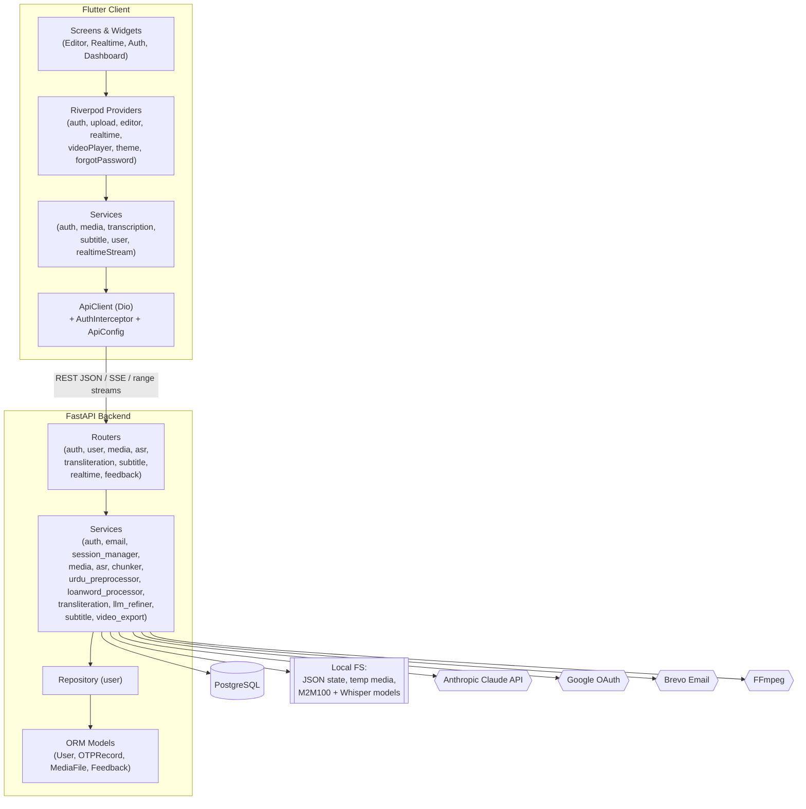

### 5.3 Package Decomposition (Package Diagram Source)

**Backend `app/`**
- `app.main` — application factory, lifespan, CORS, router registration, global exception handler, `/` and `/health`.
- `app.config` — `Settings` (env-driven).
- `app.database` — engine, session, `init_db`, `get_db`.
- `app.models` — `user` (User, OTPRecord), `media` (MediaFile), `feedback` (Feedback).
- `app.repositories` — `user` (CRUD + OTP queries).
- `app.schemas` — `user`, `subtitle`, `realtime` (Pydantic DTOs).
- `app.routers` — `auth`, `user`, `media`, `asr`, `transliteration`, `subtitle`, `realtime`, `feedback`.
- `app.services` — `auth`, `email`, `session_manager`, `media`, `asr`, `chunker_service`, `urdu_preprocessor`, `loanword_processor`, `transliteration`, `llm_refiner`, `subtitle`, `video_export`.
- `app.utils.security` — hashing, JWT, OTP generation.
- `app.data` — `loanword_dict.json`, `names_dict.json`, `subtitle_state.json`.

**Frontend `lib/`**
- `core` — `routes`, `theme`, `constants` (assets/colors/sizes/strings), `config/oauth_config`, `utils` (platform/validators).
- `models` — `auth_response`, `user`, `project`, `subtitle_project`, `transcription`, `upload_response`, `export`.
- `services` — `api/` (client/config/exception/interceptor), `auth`, `storage`, `media`, `transcription`, `subtitle`, `user`, `realtime_stream`, `google_oauth_desktop`.
- `providers` — `auth`, `upload`, `project`, `subtitle_editor`, `realtime_subtitle`, `video_player`, `theme`, `forgot_password`.
- `screens` — `splash`, `auth/*`, `dashboard`, `projects`, `editor`, `realtime`, `exports`, `feedback`, `settings`.
- `widgets` — `editor/*`, `sidebar`, `cards`, `dialogs`, `common`, `dashboard`.

### 5.4 Deployment View (Deployment Diagram Source)

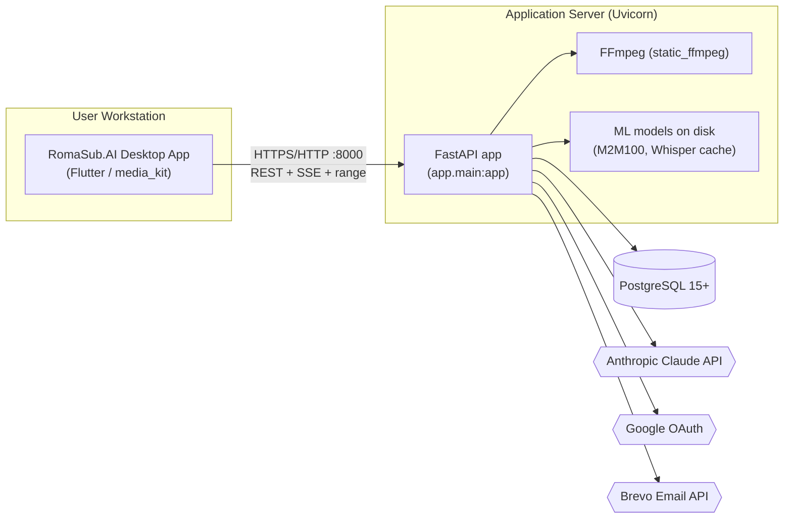

Containerization is provided via `Dockerfile` and `docker-compose.yml` (backend + PostgreSQL). The Flutter client is built per-platform (`flutter build windows|linux|macos|web`) and points to the backend through the `BASE_URL` dart-define.

---

## 6. Technology Stack

| Layer | Technology | Role |
|---|---|---|
| **Client framework** | Flutter 3.8.1+ / Dart | Cross-platform desktop/web UI. |
| **Client state** | flutter_riverpod 2.x | StateNotifier-based state management. |
| **Client HTTP** | dio 5.x | REST, multipart upload, byte/stream responses, SSE consumption. |
| **Client media** | media_kit (+ libs) | Video playback (software decoding configured). |
| **Client desktop** | window_manager | Window control (OAuth refocus). |
| **Client auth** | google_sign_in, url_launcher, shelf | Google OAuth (mobile/web + desktop loopback). |
| **Client storage** | flutter_secure_storage, shared_preferences | JWT (secure) + user/prefs. |
| **Client misc** | file_picker, image_picker, pinput, intl, mime, path_provider | Pickers, OTP input, formatting. |
| **Backend framework** | FastAPI 0.110+, Pydantic v2, Uvicorn | REST/SSE API, validation, ASGI server. |
| **Database** | PostgreSQL 15+, SQLAlchemy, Alembic, psycopg2 | Persistence + ORM. |
| **Auth** | python-jose (JWT), passlib + bcrypt, google-auth | Tokens, hashing, OAuth verification. |
| **ASR** | openai-whisper, torch | Urdu speech recognition (`medium` model). |
| **Transliteration** | transformers (M2M100), sentencepiece, safetensors | Fine-tuned Urdu→Roman Urdu. |
| **Normalization** | urduhack (leaf import, no TensorFlow) | Urdu script canonicalization. |
| **Fuzzy match** | rapidfuzz | Loanword correction. |
| **LLM refine** | anthropic (Claude Haiku 4.5) | Optional Roman Urdu polish. |
| **Media** | FFmpeg, ffmpeg-python, pydub, static_ffmpeg | Audio extraction, captioned-video render. |
| **Email** | Brevo transactional REST (via requests) | OTP delivery. |
| **Demo/eval** | streamlit; sacrebleu, jiwer, datasets | Demo UI; model evaluation scripts. |

---

## 7. The Transliteration Pipeline (Core Innovation)

This is the heart of the project and the most important subject for activity and data-flow diagrams. Each Urdu segment from Whisper passes through up to seven ordered layers before reaching the client. Layers 2 and 7 are toggleable; every stage degrades gracefully.

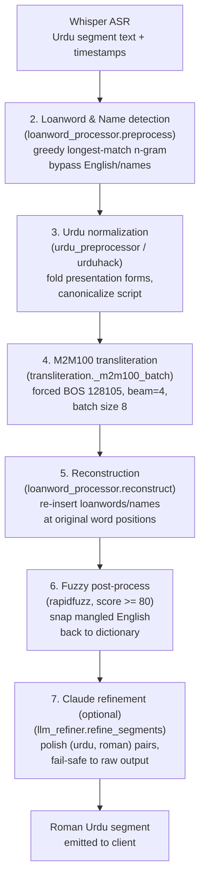

**Layer-by-layer.**

1. **ASR (Whisper).** `model.transcribe(..., language="ur", word_timestamps=True, condition_on_previous_text=False, no_speech_threshold=0.5)`. Produces `{id, start, end, text}` segments.
2. **Loanword & name detection** (`loanword_processor.preprocess`). Splits a segment on whitespace and runs a **greedy longest-match n-gram** scan (up to bigrams, since `_max_ngram = 2`) against a combined dictionary (~1,230 entries: names loaded first, loanwords override). Matches are emitted as positional `(urdu_phrase, english)` tokens; runs of non-matching Urdu words become `urdu_chunks`. Single words also try **suffix stripping** (14 Urdu suffixes) so inflected loanwords still match. Only `urdu_chunks` are sent downstream — loanwords/names bypass the model. Controlled by `enable_loanword_dict` (default `true`).
3. **Urdu normalization** (`urdu_preprocessor.preprocess_urdu_chunk`). Calls `urduhack.normalization.character.normalize` to fold Arabic presentation forms (e.g. `ﮨﮯ → ہے`) and canonicalize Unicode so the model sees consistent input. (urduhack is imported via a `sys.modules` stub so its TensorFlow-dependent `__init__` never runs.) Diacritization (`enable_diacritics`) is a reserved no-op stub.
4. **M2M100 inference** (`transliteration._m2m100_batch`). Tokenizes with `src_lang="ur"`, `max_length=128`; generates with `forced_bos_token_id=128105` (the custom Roman-Urdu target token), `num_beams=4`, `max_length=200`, under `torch.no_grad()`; batch size 8. The whole batch of Urdu chunks across all segments is processed in one call (`process_batch`) for efficiency.
5. **Reconstruction** (`loanword_processor.reconstruct`). Walks the positional token list, interleaving model output words with the bypassed English/name words at their original positions.
6. **Fuzzy post-process** (`loanword_processor.postprocess`). Flags "mangled English" words (heuristic: length ≥4 and very low vowel ratio or 4+ consecutive consonants) and snaps them to the nearest dictionary value via rapidfuzz `fuzz.ratio` when the score ≥ 80. No-ops if rapidfuzz is absent.
7. **Claude refinement** (`llm_refiner.refine_segments`). If `enable_llm_refine` is on and an API key is present, sends `[{urdu, roman}, ...]` to Claude Haiku 4.5 with a strict system prompt (return only a JSON array of strings, same length/order; preserve loanwords; Roman Urdu conventions; no translation; ASCII only). The system prompt uses ephemeral prompt caching. **Every** failure path (disabled, missing key, empty input, package missing, API error, parse/length-mismatch) logs a `Claude refiner:` line and returns the raw M2M100 output unchanged. Token usage and a sample diff are logged on success.

**Fallback philosophy.** The user always gets a result: auto-transliteration failure in ASR sets Roman fields to `None` instead of failing transcription; `transliterate_segments` swallows refiner exceptions; the refiner is purely additive. This makes the pipeline robust for a thesis "reliability" discussion.

---

## 8. Backend Detailed Design

> Convention: services are **stateless module-level functions** (not classes) except where noted; ORM models and `ProcessingSession` are the classes. ML libraries are imported **inside functions** (lazy) and models held as module-level singletons.

### 8.1 Configuration (`app/config.py`)

`Settings(BaseSettings)` loads from `.env`. Key fields: `database_url`; JWT (`secret_key`, `algorithm=HS256`, `access_token_expire_minutes=1440`); Google (`google_client_id/secret`); Brevo (`brevo_api_key`, sender email/name); `whisper_model="medium"`; M2M100 (`m2m100_model_path`, `m2m100_tokenizer_path`, `transliteration_device="auto"`); pipeline flags (`enable_diacritics=False`, `enable_loanword_dict=True`, `enable_llm_refine=True`, `claude_refine_model="claude-haiku-4-5"`, `anthropic_api_key`); upload (`max_file_size_mb=2048`, allowed video/audio extensions, `temp_upload_dir`). Properties: `allowed_extensions`, `max_file_size_bytes`.

### 8.2 Database (`app/database.py`)

SQLAlchemy engine with `pool_pre_ping=True`, `pool_size=10`, `max_overflow=20`; `SessionLocal` factory; `Base = declarative_base()`; `get_db()` request-scoped session dependency (closes in `finally`); `init_db()` registers `user` + `feedback` models and runs `create_all` (no migration step in the running app; Alembic is available but tables are auto-created on startup).

### 8.3 Security (`app/utils/security.py`)

- `get_password_hash(password)` — bcrypt via passlib; truncates to 72 bytes (bcrypt limit).
- `verify_password(plain, hashed)` — bcrypt verify.
- `create_access_token(data, expires_delta=None)` — JWT (`jose`), `exp` from settings; payload typically `{sub: uuid, email}`.
- `decode_access_token(token)` — returns payload or `None` on any `JWTError` (expired/malformed indistinguishable → uniform 401).
- `generate_otp(length=6)` — numeric OTP (uses `random`; a noted hardening point: should be `secrets`).

### 8.4 Module 1 — Auth & User

**Service (`services/auth.py`).** `OTP_VALIDITY_MINUTES = 15`; OTPs persisted in the `otp_records` table (single active per type per user). Functions: `register_user`, `authenticate_user`, `create_user_token`, `verify_google_token`, `google_auth` (id-token), `google_auth_with_code` (desktop code exchange against `oauth2.googleapis.com/token`), `create_password_reset_otp`, `verify_otp`, `reset_password`, `change_password`, `send_verification_otp`, `verify_email`, `resend_verification_otp`. Google login links an existing email account (sets `google_id`, forces `is_verified=True`) or creates a new verified user.

**Email (`services/email.py`).** Brevo transactional REST (`/v3/smtp/email`, 10 s timeout). `send_otp_email(to_email, to_name, otp, purpose)` builds an inline-CSS HTML template (`_render_otp_email`) for `password_reset` / `email_verify`. **Dev fallback:** with no API key, it logs/prints the OTP and returns success so flows still work locally. Real success requires HTTP 201.

**Repository (`repositories/user.py`).** Pure functions: `get_user_by_email/uuid/id/google_id`, `get_all_users`, `count_users`, `create_user`, `update_user`, `update_last_login`, `delete_user`, `create_otp_record`, `get_valid_otp` (unused + unexpired + matching type), `mark_otp_used`, `delete_user_otps`.

**Schemas (`schemas/user.py`).** `UserCreate` (name/email/password with strength + match validators), `UserLogin`, `UserResponse` (no password/id), `Token`, `GoogleAuthRequest`, `GoogleAuthCodeRequest`, `ForgotPasswordRequest`, `VerifyOTPRequest`, `ResetPasswordRequest`, `ChangePasswordRequest`, `UpdateProfileRequest`, `VerifyEmailRequest`, `ResendOTPRequest`, `RegistrationResponse`, `MessageResponse`.

**Routers.** `auth.py` (prefix `/auth`) — register, login (form), login/json, google, google/code, forgot-password, verify-otp, verify-email (auto-login), resend-verification-otp, reset-password, change-password (auth), me (auth). `user.py` (prefix `/users`, all authenticated) — PUT profile, POST/DELETE profile-picture (≤5 MB image), GET me/details. Dependency `get_current_user` decodes JWT → 401/403.

### 8.5 Module 2 — Media Handler (`services/media.py`, `routers/media.py`)

In-memory `_file_registry` keyed by `file_id` (UUID). `save_upload_file` streams to `temp_upload_dir` in 1 MB chunks, validates extension up front and size after write (deletes if oversized). `extract_audio` runs FFmpeg `-vn -acodec pcm_s16le -ar 16000 -ac 1` to 16 kHz mono WAV (audio files pass through). `get_audio_duration` via ffprobe. `cleanup_file` removes originals + extracted audio. Router endpoints: upload (+ anonymous), file info, extract-audio, delete, and `GET /media/{file_id}/stream` with **HTTP Range (206)** for player seeking. `MediaFile` ORM table exists for schema completeness, but the live path uses the in-memory registry.

### 8.6 Module 3 — ASR (`services/asr.py`, `routers/asr.py`)

Lazy Whisper singleton (`get_whisper_model`, CUDA if available). `transcribe_chunk(audio_path, language="ur")` returns `{text, segments[{id,start,end,text}]}`. `transcribe_audio(file_id, language, auto_cleanup)` orchestrates: get file → extract audio → transcribe → store result in in-memory `_transcription_results[file_id]` → **auto-transliterate** (adds `roman_urdu_text`, `roman_urdu_segments`; sets them `None` on failure) → **auto-create subtitle project** → optional cleanup. Router: `POST /asr/transcribe/{file_id}` (+ anonymous), `GET /asr/result/{file_id}`, `GET /asr/result/{file_id}/srt` (returns SRT inside JSON and records an export), `GET /asr/languages`.

### 8.7 Module 4 — Chunker & Real-time Session

**Chunker (`services/chunker_service.py`).** Constants `CHUNK_DURATION=30s`, `OVERLAP_DURATION=2s`, `STEP_SIZE=28s`. `compute_chunk_plan(total_duration)` builds overlapping windows (≈129 for a 1-hour file); `extract_chunk_audio` cuts a 16 kHz mono PCM chunk via FFmpeg; `offset_segments` shifts chunk-relative timestamps to absolute; `trim_overlap_segments` drops duplicate segments in the overlap (earlier chunk authoritative — robust to Whisper's boundary non-determinism); `cleanup_chunk_file`.

**Session manager (`services/session_manager.py`).** In-memory `_active_sessions` keyed by `file_id`. `ProcessingSession` holds `chunks`, `chunk_status`, `all_segments`, `processed_through`, an `asyncio.Queue` (SSE events) and a `PriorityQueue` (chunk work), plus `status` (`buffering|streaming|complete|error`). Methods: `enqueue_initial_chunks(buffer_count=3)`, `reprioritize_for_seek(target_seconds)` (bumps the target chunk + 2 ahead to priority 0), `add_completed_segments`, `emit_event`. Lifecycle: `create_session` (idempotent), `get_session`, `remove_session`.

### 8.8 Module 5 — Urdu Preprocessor (`services/urdu_preprocessor.py`)

`load_diacritizer()` (eager startup hook, idempotent), `preprocess_urdu_chunk(text)` (urduhack normalize; diacritization is a logged no-op), `preprocess_urdu_chunks(list)`. Notable: a `sys.modules` stub of `urduhack` is installed before importing the leaf normalizer to avoid the TensorFlow-addons import chain.

### 8.9 Module 6 — Transliteration (`services/transliteration.py`, `services/loanword_processor.py`, `services/llm_refiner.py`)

Detailed in Section 7. Public surface of `transliteration.py`: `transliterate_text`, `transliterate_batch` (switches on `enable_loanword_dict`), `transliterate_segments` (builds `{id,start,end,urdu_text,roman_urdu_text}` then calls the refiner), `transliterate_transcription(file_id)` (stores `_transliteration_results[file_id]`), `get_transliteration_result`, `format_roman_urdu_srt`. `loanword_processor` exposes `preprocess`, `reconstruct`, `postprocess`, `process_text`, `process_batch`, and dictionary loaders. `llm_refiner` exposes `init_refiner`, `refine_segments`. Router `transliteration.py` (prefix `/transliterate`): `POST /text`, `POST /{file_id}` (+ anonymous), `GET /result/{file_id}`, `GET /result/{file_id}/srt`.

### 8.10 Module 7 — Subtitle Editing (`services/subtitle.py`, `routers/subtitle.py`)

**State.** Three module dicts (`_subtitle_projects`, `_file_to_subtitle`, `_export_history`) persisted to `app/data/subtitle_state.json` via **atomic temp-file + `os.replace`**; loaded on import so projects survive restarts. **Segment model:** `{id, start, end, urdu_text, roman_urdu_text, is_edited}`. **Validation constants:** `MAX_SEGMENT_CHARS=500`, `MIN/MAX_SEGMENT_DURATION=0.5/7.0 s`, `MIN_GAP=0.1 s`. **Functions:** `create_project` (idempotent; zips Urdu + Roman segments from the ASR result), `get_project`, `get_project_by_file`, `list_all_projects`, `record_export`, `list_exports`, `update_segment`, `add_segment`, `delete_segment`, `bulk_update` (auto-save full replace), `fix_overlaps`, and formatters `format_as_srt/vtt/txt` + `export_subtitles`. **Caption rule (single-sourced):** `roman_urdu_text or urdu_text` (Roman with Urdu fallback), used everywhere including video export.

**Router (prefix `/subtitles`):** create/{file_id}; GET {subtitle_id}; PUT segments/{segment_id}; POST segments; DELETE segments/{segment_id}; PUT bulk-update; POST fix-overlaps; GET export (`?format=srt|vtt|txt`, returns content in JSON, records history); GET export-video (`?mode=hardsub|softsub`, FileResponse with background temp-file delete); list/projects; list/exports.

### 8.11 Module 8 — Captioned Video Export (`services/video_export.py`)

`VALID_MODES=("hardsub","softsub")`, `VIDEO_EXPORT_TIMEOUT_SECONDS=1800` (30 min). Validation order maps to HTTP status: bad mode/no segments/not-video → 400; project/source missing → 404; render/FFmpeg failure → 500. Writes a temp SRT (`format_as_srt`), runs FFmpeg synchronously, then cleans up.

- **hardsub:** `ffmpeg -y -i <in> -vf subtitles='<escaped srt>' -c:v libx264 -preset veryfast -crf 23 -c:a aac -movflags +faststart <out>` — burns captions in (re-encode).
- **softsub:** `ffmpeg -y -i <in> -i <srt> -map 0:v -map 0:a? -map 1 -c copy -c:s mov_text -movflags +faststart <out>` — muxes a toggleable `mov_text` track (stream copy, near-instant; `-map 0:a?` keeps audio optional and avoids copying incompatible source streams).

Temp SRT removed in `finally` on every path; output MP4 removed by the router's `BackgroundTask` after streaming.

### 8.12 Module 9 — Real-time SSE (`routers/realtime.py`)

`GET /realtime/stream/{file_id}?language=ur` returns `text/event-stream` (headers disable proxy buffering). **Fast path:** if a completed transcription exists, emits one `chunk_ready` (all segments), then `buffer_ready`, then `stream_complete` instantly. **Slow path:** extract audio → compute chunk plan → create session → enqueue first 3 chunks → background `_process_chunks` task. Each chunk runs in a thread-pool: extract chunk audio → Whisper → offset/trim timestamps → per-segment M2M100 transliterate (+ optional refine) → emit `chunk_ready`; `buffer_ready` emitted once after the buffer fills; `stream_complete` at the end; `error` on failure. `event_generator` pulls events with a 300 s keepalive and cancels the task on disconnect. `POST /realtime/seek/{file_id}` reprioritizes; `GET /realtime/status/{file_id}` is a polling fallback. SSE payloads are defined in `schemas/realtime.py` (`ChunkReadyData`, `BufferReadyData`, `StreamCompleteData`, `SeekRequest`, `SessionStatusResponse`).

### 8.13 Module 10 — Feedback (`models/feedback.py`, `routers/feedback.py`)

PostgreSQL-backed. `POST /feedback/submit` (`rating` 1–5, optional `comment`, `feedback_type`) inserts a `Feedback` row and returns its `feedback_id`. `GET /feedback/list` returns the latest ≤50 with an average rating and total count.

---

## 9. Frontend Detailed Design

> State management is **Riverpod** (the legacy `FrontEnd/CLAUDE.md` describing InheritedWidget is stale). Pattern: `StateNotifierProvider` for app state; `Provider` for services; `FutureProvider` for async/storage and read-only backend lists.

### 9.1 Bootstrap & Navigation

`main()` initializes `MediaKit`, and (desktop) `window_manager`, then runs `ProviderScope(child: MyApp())`. `MyApp` (ConsumerWidget) builds `MaterialApp` with light/dark themes, `themeMode` from `themeProvider`, `initialRoute = splash`, and `onGenerateRoute = AppRoutes.generateRoute`. `AppRoutes` centralizes route names (`splash`, `login`, `signup`, `emailVerification`, `dashboard`, `projects`, `exports`, `feedback`, `settings`, `editor`, `realtimeViewer`, `forgotPassword*`) and helpers (`to`, `replace`, `clearAndGo`, `back`).

### 9.2 API Layer

- **`ApiConfig`** — `baseUrl` from `--dart-define=BASE_URL` (default `http://localhost:8000`); every backend route as a constant/builder; timeouts (connect/receive 30 s, `videoExportTimeout` 10 min); upload limits.
- **`ApiClient`** — Dio with base options + `AuthInterceptor` + `LogInterceptor`; exposed via `apiClientProvider`.
- **`AuthInterceptor`** — injects `Authorization: Bearer <token>` from secure storage; on 401 clears storage (logout).
- **`ApiException`** hierarchy — `NetworkException`, `UnauthorizedException` (401), `ValidationException` (400, field errors), `ServerException` (404/5xx). All services map `DioException` → these, reading backend `detail`.

### 9.3 Services (API Wrappers)

| Service | Calls | Notes |
|---|---|---|
| `AuthService` | `/auth/*` | login, register, verifyEmail, resend OTP, google (id-token + code), me, change/forgot/verify-otp/reset password. |
| `StorageService` | secure storage + prefs | `access_token` (secure); `user_json`, `projects_list`, `is_dark_mode` (prefs). |
| `MediaService` | `/media/*` | multipart upload with progress, info, delete, extract-audio. |
| `TranscriptionService` | `/asr/*`, `/transliterate/*` | transcribe (10-min timeout), poll result (3 s interval, 5-min cap), SRT downloads, text transliteration. |
| `SubtitleService` | `/subtitles/*` | CRUD on segments, bulk-update, fix-overlaps, export (text), `downloadVideoWithCaptions` (bytes; filename from `content-disposition`). |
| `UserService` | `/users/*` | profile + avatar (absolute URLs). |
| `RealtimeStreamService` | `/realtime/*` | SSE consumption (manual `\n\n` framing, no timeout), seek, status. |
| `GoogleOAuthDesktopService` | local loopback :8080 | desktop auth-code flow; styled callback page; refocuses window. |

### 9.4 State (Riverpod Providers / Notifiers)

| Provider | Type | State highlights |
|---|---|---|
| `authNotifierProvider` | StateNotifier | `user, isLoading, error`; login/register/verify/google/logout/profile. Builds the right Google service per platform; `_LoadingAuthNotifier` while storage loads. |
| `uploadNotifierProvider` | StateNotifier | `UploadPhase` (idle→uploading→extractingAudio→transcribing→transliterating→completed/error), progress, transcription; orchestrates upload→extract→transcribe→poll. |
| `editorNotifierProvider` | StateNotifier.autoDispose | project, selection, undo/redo (50), search, `hasUnsavedChanges`, 30 s auto-save; edit text/timing, add/delete, fix overlaps, save (bulk-update), export, exportVideo, `getSegmentAtTime` (binary search). |
| `realtimeNotifierProvider` | StateNotifier.autoDispose | `RealtimePhase`, streamed segments, `processedThrough`, chunk counts; handles SSE events; debounced seek; editor handoff. |
| `videoPlayerNotifierProvider` | StateNotifier.autoDispose | media_kit `Player`/`VideoController`, position/duration/volume/buffering, subtitle visibility, seek callback. |
| `themeProvider` | StateNotifier | `ThemeMode` persisted to `is_dark_mode`. |
| `forgotPasswordProvider` | StateNotifier | `ForgotPasswordStep` (enterEmail→verifyOtp→resetPassword). |

### 9.5 Models

`AuthResponseModel`, `RegistrationResponse`, `MessageResponse`; `UserModel` (uuid, names, email, avatar, verified, googleId); `EditableSegment` (mutable; `duration`, `isValid` 0.5–7 s & ≤500 chars, `formatTimestamp`) and `SubtitleProject`; `TranscriptionModel` (+ `TranscriptionSegment`, `TransliteratedSegment`, SRT helpers); `UploadResponseModel`; legacy sample `Project`/`Export`.

### 9.6 Screens & Editor Composition

- **Auth flow:** `SplashScreen` (2 s) → `LoginScreen` ↔ `SignUpScreen` → `EmailVerificationScreen` (pinput OTP, 60 s resend cooldown); 3-step forgot-password wizard.
- **Dashboard:** greeting, dashed-border upload drop, status indicators; file picker → `UploadProgressDialog`.
- **UploadProgressDialog (hub):** phase-driven; offers "Skip wait — Watch with Live Subtitles" (→ realtime), and on completion a `TranscriptionCompleteDialog` (download SRT / view details / edit).
- **RealtimeViewerScreen:** SSE-driven live captions over the video with a phase chip, buffering UI, `SubtitleOverlay`, progress bar, and "Open Subtitle Editor".
- **SubtitleEditorScreen (core):** three panels — `VideoPreviewPanel` (+ `VideoControls`, `SubtitleOverlay`), `SubtitleListPanel` (`SegmentTile`s with auto-scroll to the active segment), `TextEditorPanel` (Roman editable + Urdu read-only RTL, `TimingAdjuster`s, play/delete/add). Top `EditorToolbar` (back, undo/redo, save, fix-overlaps, export menu). Keyboard: Ctrl+Z/Y, Ctrl+S, Space.
- **Projects / Exports:** backend-backed lists via co-located `FutureProvider.autoDispose` + `AsyncValue.when`.
- **Feedback / Settings:** rating form; profile/password/account/appearance (dark-mode switch).
- **Sidebar:** fixed rail — Dashboard, Recent Projects, Exports, Feedback, Settings, Logout.

### 9.7 Theming

Material 3, light + dark, monochrome inverted palette (black↔white) with shared status colors; persisted dark mode; Windows font fallbacks aid Urdu glyph rendering. Editor/realtime widgets use `AppColors.getX(isDark)` helpers.

---

## 10. Data Model (ER + Class Diagram Source)

### 10.1 Persistent Entities (PostgreSQL — ERD)

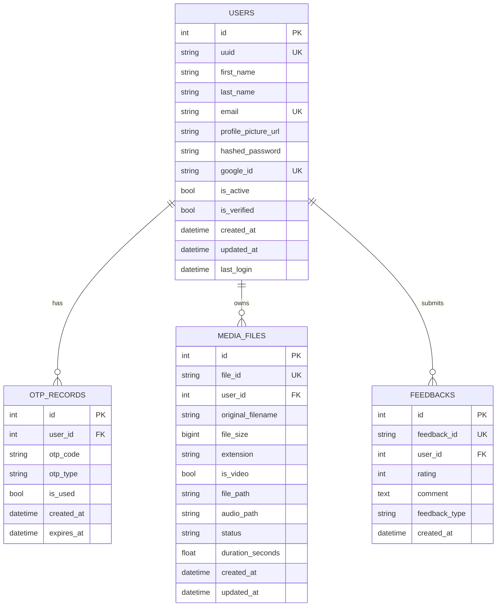

`otp_type` ∈ {`password_reset`, `email_verify`}; `MEDIA_FILES.status` ∈ {uploaded, processing, completed, failed}; FK deletes cascade.

### 10.2 Non-Database State

| Store | Backed by | Lifetime | Holds |
|---|---|---|---|
| Media registry | in-memory dict (`media._file_registry`) | per process | uploaded-file metadata. |
| Transcription results | in-memory dict (`asr._transcription_results`) | per process | Whisper output + Roman segments. |
| Transliteration results | in-memory dict | per process | Roman Urdu results. |
| Real-time sessions | in-memory dict (`session_manager`) | per process | streaming session + queues. |
| Subtitle projects + export history | JSON file (`app/data/subtitle_state.json`, atomic write) | persistent | editable projects, file→project map, exports. |

> **Diagram note.** A persisted subtitle project can outlive its in-memory media metadata — exactly the "source video no longer available" (404) case in video export. Useful for a sequence/exception diagram.

### 10.3 Pydantic Schema Classes (DTO Class Diagram)

`schemas/user.py`, `schemas/subtitle.py` (`SubtitleSegmentSchema`, `CreateSubtitleRequest`, `UpdateSegmentRequest`, `AddSegmentRequest`, `BulkUpdateRequest`, `SubtitleProjectResponse`, `SegmentResponse`, `ExportResponse`), `schemas/realtime.py` (`ChunkInfo`, `ChunkReadyData`, `BufferReadyData`, `StreamCompleteData`, `SeekRequest`, `SessionStatusResponse`). Field-level detail in Sections 8.4 and 8.10.

### 10.4 Flutter Model Classes

See Section 9.5. `EditableSegment` and `SubtitleProject` mirror the backend segment/project shapes (`roman_urdu_text`, `urdu_text`, `is_edited`).

---

## 11. Complete API Reference

> Base URL default `http://localhost:8000`. Auth = JWT bearer required.

### Authentication (`/auth`)
| Method | Path | Auth | Body | Returns |
|---|---|---|---|---|
| POST | `/auth/register` | – | UserCreate | RegistrationResponse (201) |
| POST | `/auth/login` | – | form (username, password) | Token |
| POST | `/auth/login/json` | – | UserLogin | Token |
| POST | `/auth/google` | – | {id_token} | Token |
| POST | `/auth/google/code` | – | {code, redirect_uri} | Token |
| POST | `/auth/forgot-password` | – | {email} | MessageResponse |
| POST | `/auth/verify-otp` | – | {email, otp} | MessageResponse |
| POST | `/auth/verify-email` | – | {email, otp} | Token (auto-login) |
| POST | `/auth/resend-verification-otp` | – | {email} | MessageResponse |
| POST | `/auth/reset-password` | – | {email, otp, new_password, confirm_password} | MessageResponse |
| POST | `/auth/change-password` | ✓ | {current, new, confirm} | MessageResponse |
| GET | `/auth/me` | ✓ | – | UserResponse |

### Users (`/users`, all auth)
| Method | Path | Body | Returns |
|---|---|---|---|
| PUT | `/users/profile` | {first_name, last_name} | UserResponse |
| POST | `/users/profile-picture` | multipart file | MessageResponse |
| DELETE | `/users/profile-picture` | – | MessageResponse |
| GET | `/users/me/details` | – | UserResponse |

### Media (`/media`)
| Method | Path | Notes |
|---|---|---|
| POST | `/media/upload` (+ `/upload/anonymous`) | multipart file → file_id |
| GET | `/media/{file_id}` | metadata |
| POST | `/media/{file_id}/extract-audio` | WAV extraction |
| DELETE | `/media/{file_id}` | delete |
| GET | `/media/{file_id}/stream` | range-enabled stream (206) |

### ASR (`/asr`)
| Method | Path | Notes |
|---|---|---|
| POST | `/asr/transcribe/{file_id}` (+ `/anonymous`) | transcribe (auto-transliterate) |
| GET | `/asr/result/{file_id}` | result |
| GET | `/asr/result/{file_id}/srt` | SRT (JSON field; records export) |
| GET | `/asr/languages` | supported languages |

### Transliteration (`/transliterate`)
| Method | Path | Notes |
|---|---|---|
| POST | `/transliterate/text` | one-off text |
| POST | `/transliterate/{file_id}` (+ `/anonymous`) | re-run on a transcription |
| GET | `/transliterate/result/{file_id}` | result |
| GET | `/transliterate/result/{file_id}/srt` | Roman SRT (records export) |

### Subtitles (`/subtitles`)
| Method | Path | Notes |
|---|---|---|
| POST | `/subtitles/create/{file_id}` | create project |
| GET | `/subtitles/{subtitle_id}` | project |
| PUT | `/subtitles/{subtitle_id}/segments/{segment_id}` | edit segment |
| POST | `/subtitles/{subtitle_id}/segments` | add segment |
| DELETE | `/subtitles/{subtitle_id}/segments/{segment_id}` | delete segment |
| PUT | `/subtitles/{subtitle_id}/bulk-update` | full replace (auto-save) |
| POST | `/subtitles/{subtitle_id}/fix-overlaps` | auto-fix |
| GET | `/subtitles/{subtitle_id}/export?format=srt\|vtt\|txt` | text export |
| GET | `/subtitles/{subtitle_id}/export-video?mode=hardsub\|softsub` | captioned MP4 |
| GET | `/subtitles/list/projects` | projects |
| GET | `/subtitles/list/exports` | export history |

### Realtime (`/realtime`)
| Method | Path | Notes |
|---|---|---|
| GET | `/realtime/stream/{file_id}?language=ur` | SSE stream |
| POST | `/realtime/seek/{file_id}` | reprioritize on seek |
| GET | `/realtime/status/{file_id}` | polling status |

### Feedback (`/feedback`)
| Method | Path | Notes |
|---|---|---|
| POST | `/feedback/submit` | {rating, comment?, feedback_type} |
| GET | `/feedback/list` | latest ≤50 + average |

### Root
`GET /` (info), `GET /health` (status), `GET /docs` (OpenAPI UI), `/uploads/*` (static avatars).

---

## 12. Sequence Flows (Sequence Diagram Source)

### 12.1 Registration + Email Verification

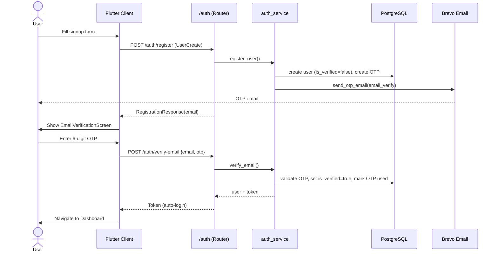

### 12.2 Login (Email/Password)

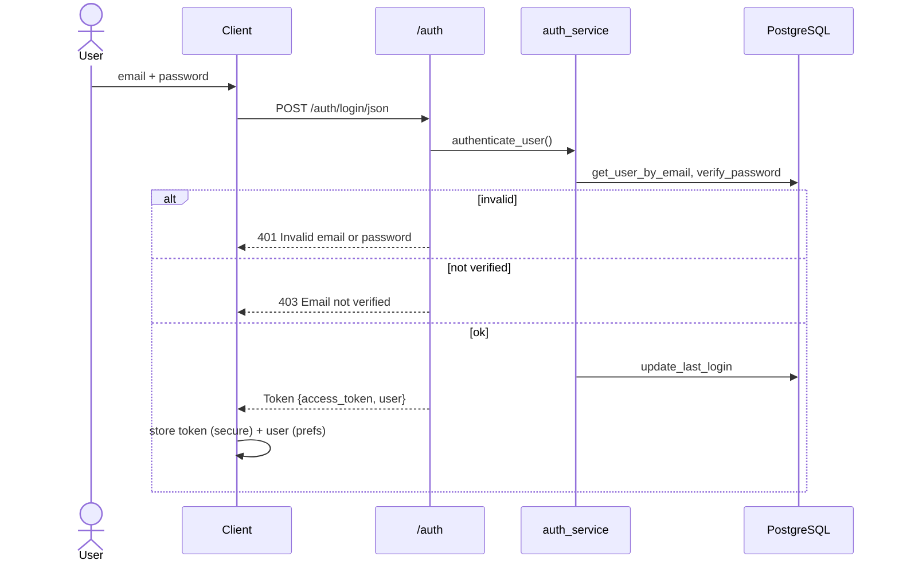

### 12.3 Google Sign-in (Desktop Auth-Code)

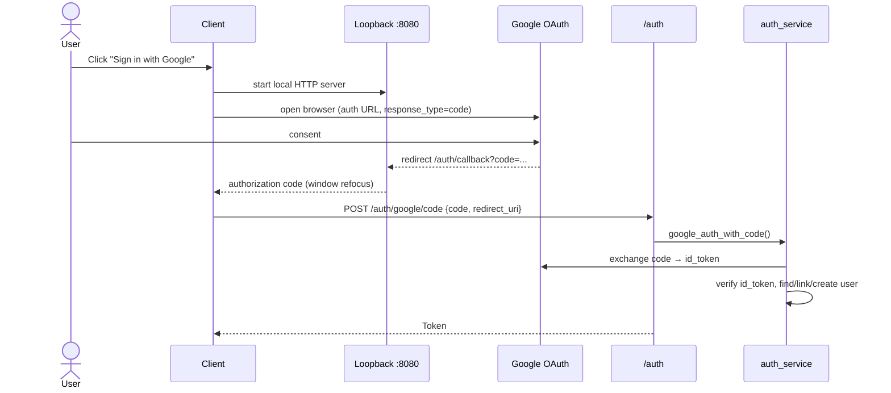

### 12.4 Upload → Transcribe → Transliterate (Batch)

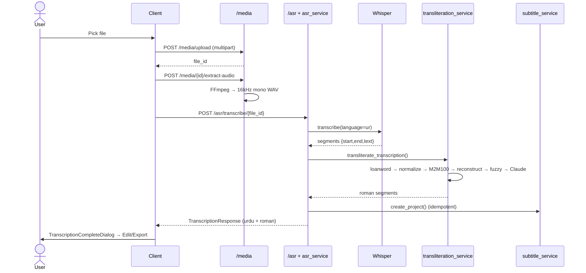

### 12.5 Real-time SSE Streaming + Seek

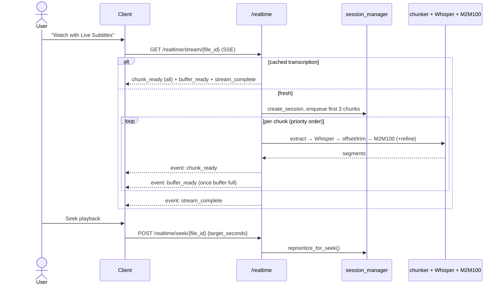

### 12.6 Subtitle Edit + Auto-save

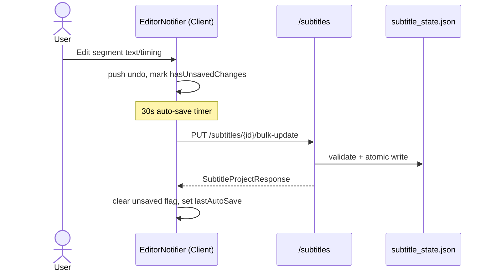

### 12.7 Captioned Video Export

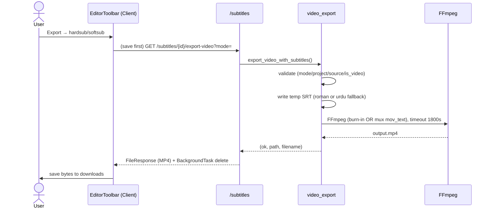

### 12.8 Forgot / Reset Password

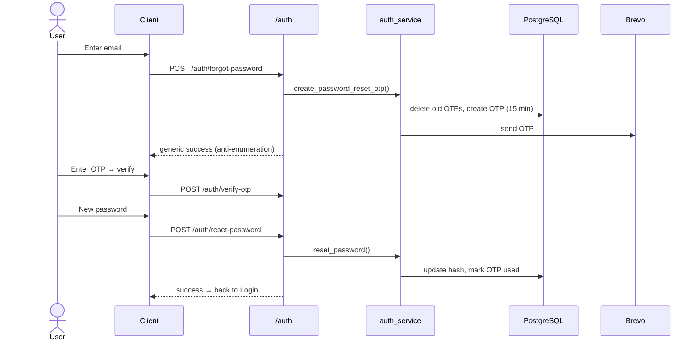

---

## 13. State Transition Models (State Diagram Source)

### 13.1 Upload Phase (client `UploadNotifier`)

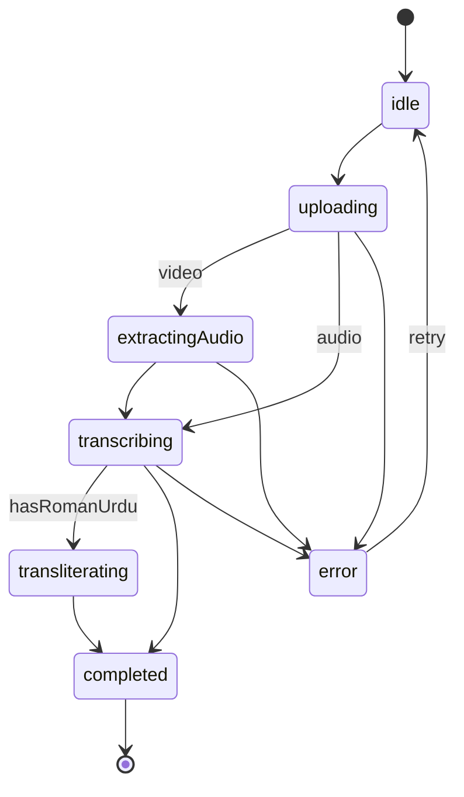

### 13.2 Real-time Phase (client) and Processing Session `status` (server)

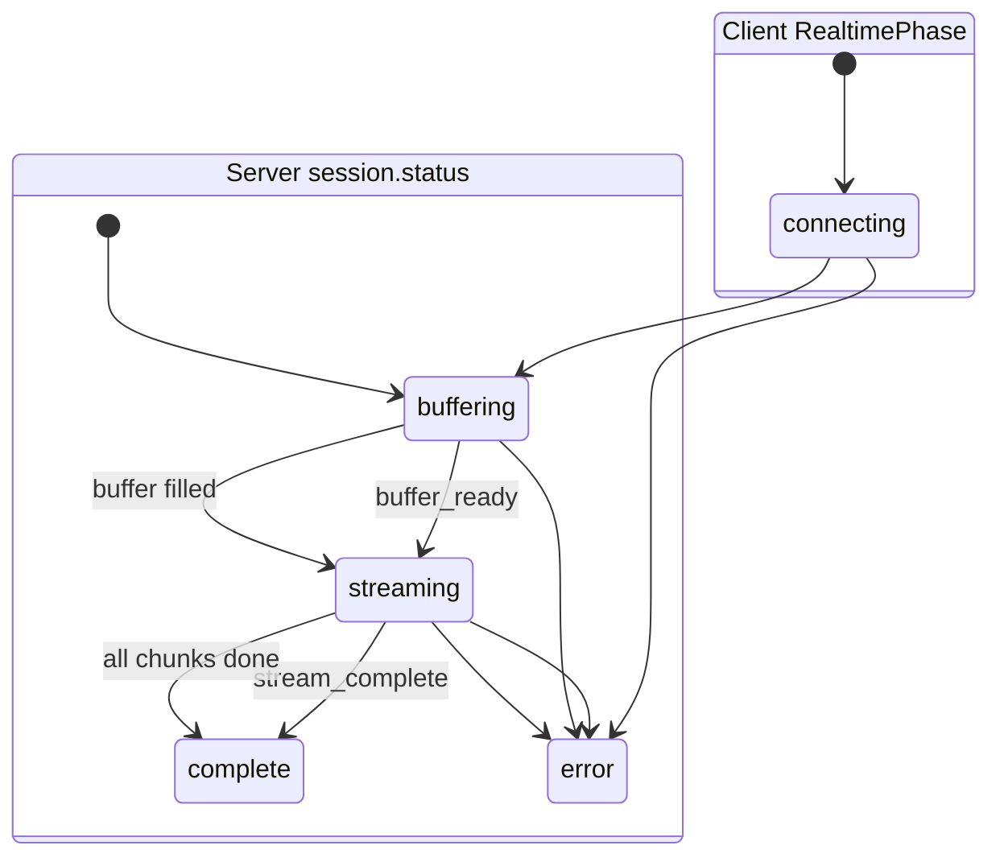

### 13.3 Media File `status` (server)

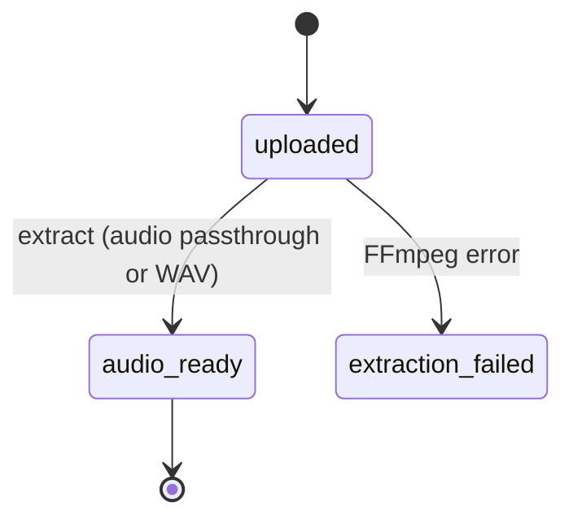

### 13.4 Subtitle Segment (editor)

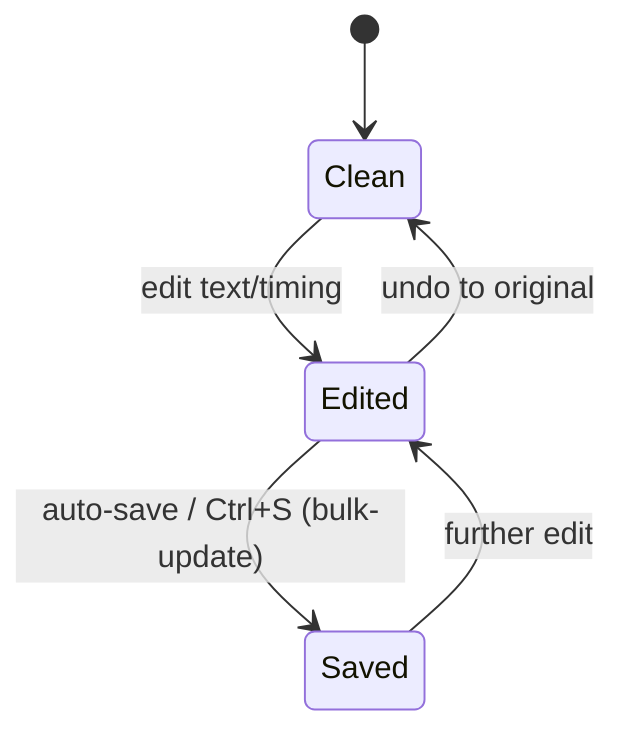

---

## 14. Data Flow (DFD-Aligned)

**Level-0 (context).** External entities — *User*, *Google OAuth*, *Brevo*, *Anthropic*. Process — *RomaSub.AI System*. Data stores — *PostgreSQL*, *Subtitle JSON state*, *Temp media + models*.

**Level-1 (major processes).**

1. **Authenticate User** — in: credentials/OTP/Google token; out: JWT; stores: USERS, OTP_RECORDS; externals: Google, Brevo.
2. **Handle Media** — in: media file; out: file_id, extracted audio; store: temp media (+ MEDIA_FILES schema).
3. **Transcribe (ASR)** — in: audio; out: Urdu segments; uses Whisper; store: in-memory results.
4. **Transliterate** — in: Urdu segments; out: Roman segments; uses dictionaries, M2M100, Claude.
5. **Stream Real-time** — in: file_id, seek; out: SSE caption events; uses session + chunker.
6. **Edit Subtitles** — in: segment edits; out: updated project; store: subtitle JSON state.
7. **Export** — in: subtitle_id, format/mode; out: SRT/VTT/TXT or MP4; uses FFmpeg; store: export history.
8. **Collect Feedback** — in: rating/comment; store: FEEDBACKS.

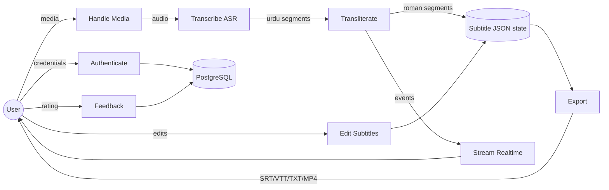

---

## 15. Design Decisions and Rationale

| Decision | Rationale | Trade-off |
|---|---|---|
| Dictionary bypass for loanwords/names before the model | M2M100 mangles English words and proper nouns; bypassing preserves them exactly | Dictionary coverage must be maintained; toggle (`enable_loanword_dict`) exists for unverified content. |
| Fine-tuned M2M100 with a custom Roman-Urdu target token (128105) | Off-the-shelf models don't target Roman Urdu | Requires training data and a shipped model artifact. |
| Optional Claude refinement, purely additive | Improves fluency without making the pipeline depend on a paid API | Cost/latency when enabled; off by default in docs (`true` in code config). |
| Graceful degradation at every layer | Reliability — the user always gets a caption | Silent fallbacks can hide quality regressions (mitigated by `Claude refiner:` logs). |
| Layered, stateless backend services | Testability and clarity; functions over classes | Cross-request state lives in module globals (per-process). |
| Riverpod StateNotifier on the client | Predictable, testable state; clean editor panel composition | Migration from the original InheritedWidget design (docs lagged). |
| File-based subtitle state (atomic JSON) vs in-memory media | Projects must survive restarts; media is transient | A project can outlive its source media (handled as 404 on export). |
| SSE for real-time captions with fast/slow paths | One-way streaming fits incremental captions; cached files replay instantly | In-memory sessions are per-process, not multi-worker safe. |
| Synchronous video render with 30-minute timeout | Simplicity; no job-queue infrastructure | A long render holds a request worker; not suitable for many concurrent renders. |
| Chunk overlap + earlier-chunk-authoritative trim | Whisper is non-deterministic at boundaries | Slight extra compute on the 2-second overlap. |
| media_kit software decoding (hwdec off) | Fixes Linux libmpv black-frame/assertion crashes | Higher CPU use for decoding. |

---

## 16. Security Considerations

- **Passwords:** bcrypt (passlib), 72-byte truncation guard; strength enforced at schema (≥8 chars, letter+digit+special).
- **Tokens:** stateless JWT (`{sub: uuid, email}`), HS256, 24-hour expiry; no refresh/revocation; client stores JWT in secure storage and clears on 401.
- **OTPs:** DB-persisted, single-use, 15-minute expiry, one active per type per user; password-reset and resend responses avoid account enumeration.
- **Transport/CORS:** CORS currently `*` (open) — should be restricted in production.
- **Hardening points (thesis "future security work"):** use `secrets` for OTP generation; enforce Google `email_verified` before linking; restrict CORS; add rate limiting; move secrets fully to environment management; consider token revocation.

---

## 17. Limitations and Known Gaps

- Media metadata and real-time sessions are **in-memory per process** (lost on restart; not shared across multiple Uvicorn workers).
- Video rendering is **synchronous** (no background queue); bounded by a 30-minute timeout.
- `bulk_update` (auto-save) skips the duration/length **business validation** that single-segment edits enforce (Pydantic still enforces `end>start` and ≤500 chars).
- No subtitle **styling/position** controls in export (plain SRT styling).
- **Diacritization** is a reserved no-op stub.
- A few **placeholder/legacy** files remain (`recent_projects_screen.dart` re-export; empty dashboard widget placeholders; sample `Project`/`Export` classes).
- `FrontEnd/CLAUDE.md` is **stale** (describes the pre-Riverpod design).
- Upload size is checked **after** the file is written to disk.

---

## 18. Future Work

1. Background job queue (e.g. Celery/RQ) for large video renders with progress polling.
2. Shared session store (Redis) so real-time streaming and media metadata survive restarts and scale across workers.
3. Subtitle styling/positioning and burned-in font controls.
4. Expand and verify the loanword/name dictionaries; add an automated audit.
5. Real Urdu diacritization stage (currently stubbed).
6. Persist media metadata in PostgreSQL (the `MediaFile` table already exists) and add cloud storage.
7. Quantitative evaluation harness (WER for ASR, BLEU/CER for transliteration) — partial scripts exist under `eval_results/`.
8. Security hardening (Section 16).
9. Mobile-optimized responsive UI.

---

## 19. Appendices

### 19.1 Directory Map (abridged)

```
RomaSub.Ai/
├── app/                       # FastAPI backend
│   ├── main.py config.py database.py
│   ├── models/   (user, media, feedback)
│   ├── repositories/ (user)
│   ├── schemas/  (user, subtitle, realtime)
│   ├── routers/  (auth, user, media, asr, transliteration, subtitle, realtime, feedback)
│   ├── services/ (auth, email, session_manager, media, asr, chunker_service,
│   │              urdu_preprocessor, loanword_processor, transliteration,
│   │              llm_refiner, subtitle, video_export)
│   ├── utils/security.py
│   └── data/ (loanword_dict.json, names_dict.json, subtitle_state.json)
├── FrontEnd/                  # Flutter client
│   ├── lib/main.dart
│   ├── lib/core/ (routes, theme, constants, config, utils)
│   ├── lib/models/ lib/providers/ lib/services/ lib/screens/ lib/widgets/
│   └── pubspec.yaml
├── demo/demo_ui.py            # Streamlit demo
├── Documentation/            # SDD.pdf, SRS.pdf, Project Overview.pdf, DIAGRAMS/, this file
├── docs/superpowers/         # design spec + plan for video export
├── eval_results/             # M2M100 evaluation runs
├── Dockerfile docker-compose.yml requirements.txt README.md SETUP.md
```

### 19.2 Key Configuration / Environment Variables

| Variable | Default | Purpose |
|---|---|---|
| `DATABASE_URL` | local postgres | DB connection. |
| `SECRET_KEY` / `ALGORITHM` / `ACCESS_TOKEN_EXPIRE_MINUTES` | – / HS256 / 1440 | JWT. |
| `GOOGLE_CLIENT_ID` / `GOOGLE_CLIENT_SECRET` | empty | OAuth. |
| `BREVO_API_KEY` / `BREVO_SENDER_EMAIL` / `BREVO_SENDER_NAME` | empty / noreply@romasub.me / RomaSub.AI | Email OTP. |
| `WHISPER_MODEL` | medium | ASR model size. |
| `M2M100_MODEL_PATH` / `M2M100_TOKENIZER_PATH` | models/m2m100_ur_to_rur / models/m2m100_tokenizer | Transliteration model. |
| `TRANSLITERATION_DEVICE` | auto | cuda/cpu. |
| `ENABLE_LOANWORD_DICT` | true | Dictionary bypass layer. |
| `ENABLE_LLM_REFINE` / `CLAUDE_REFINE_MODEL` / `ANTHROPIC_API_KEY` | true / claude-haiku-4-5 / empty | Claude refinement. |
| `ENABLE_DIACRITICS` | false | Reserved stub. |
| `MAX_FILE_SIZE_MB` | 2048 | Upload cap. |
| `BASE_URL` (client, dart-define) | http://localhost:8000 | Backend address. |

### 19.3 Cross-Reference to Existing Diagrams

The `Documentation/DIAGRAMS/` folder already contains rendered UML/diagrams that this document supplements with up-to-date source detail:

| Existing PNG | This document's source section |
|---|---|
| `UseCase.png` | §4 Use Cases |
| `Architecture.png`, `Package.png` | §5 Architecture / Package |
| `Deployment.png` | §5.4 Deployment |
| `ERD.png` | §10.1 ER model |
| `DFD.png` | §14 Data Flow |
| `Activity.png` | §7 Pipeline activity |
| `StateTransition.png` | §13 State models |
| `System Sequence PNG/*` (Login, RegisterAccount, ResetPassword, ExportSubtitles, Real-time…, ProvideSubtitleFeedback, ManageUserProfile, Logout) | §12 Sequence flows |

Formal `SRS.pdf`, `SDD.pdf`, and `Project Overview.pdf` remain the authoritative requirement/design records; this summary reflects the **as-built** system and is the recommended source when regenerating diagrams.

---

*End of document.*
